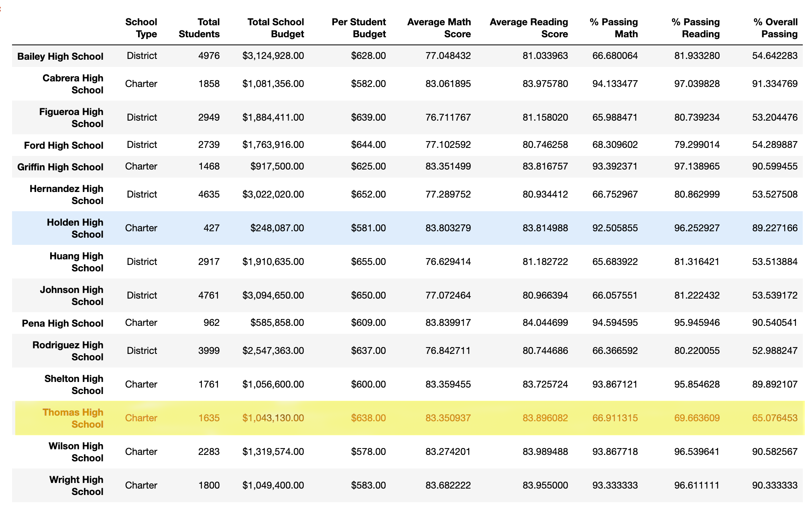
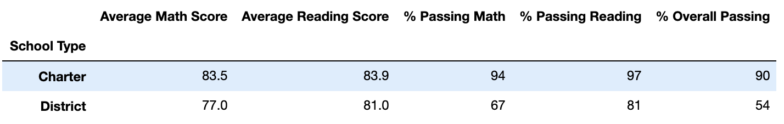

# School_District_Analysis
## Overview of the school district analysis: 
The school board discovered that the students_complete.csv file shows evidence of academic dishonesty. The math and reading grades of ninth graders have been adjusted in Thomas High School. The school board request is prepare written report to describe how the math and reading grades replace with NaN in Thomas High School will affect the overall analysis.

## Results: 
### Deliverable 1: Replace the reading and math scores.
Replace the 9th grade reading and math scores at Thomas High School with NaN.

Step 1. Import numpy as np.

Step 2. I used loc method on the student_data_df to select all the reading scores from the 9th grade at Thomas High.

Step 3. Refactor the code in Step 2 to replace the math scores with NaN.

Step 4. Check the student data for NaN's. 

### Deliverable 2 : Repeat the school district analysis
### District Summary
Step 1. Combine the data (student_data and school_data)into a single dataset.

 Step 2. Calculate tootal numbers of schools, students and the total budget. 
 Schools: 15 
 Students: 39,170 
 The Total Budget: $24,649.428 

 Step 3. Calculate the Average Scores using the "clean_student_data". 
 Average of clean reading score is 81.85579580976001 compare to original school data 81.87784018381414. The dirrence is 0.02204437405413. 
 Average of clean math score is 78.93053295099331 compare to original school data 78.98537145774827. The dirrence is 0.05483850675496. 

Please see below average reading and math scores from original school data:

Step 4. Get the number of students that are in ninth grade at Thomas High School.
Total number of students in 9th grade at Thomas High School is 461. Which is 1.06% 9th grade students from 39,170 students.

Step 5. Subtract the number of students that are in ninth grade at Thomas High School from the total student count to get the new total student count.

Step 6. Calculate the passing rates using the "clean_student_data".

<bk>Passing math count from the clean student data is 28,939 which is 74.76% compare to original passing math count 29,370 which is 74,98%.</bk>
<bk>Passing reading count from the clean student data is 33,158. which  is 85.65% compare to original passing reading count 33610 which is 85.80%..</bk> 

Overall passing percentage is 64.9% compare to the orogonal data 65.2%. The difference is 0.3%.

As a result, the district summary with the clean student data did affect approx. on 0.3% on the data results.

Please see below the district summary:

### School Summary 
Please see below per School Summary:

Please see below how replacing the ninth graders’ math and reading scores affects Thomas High School’s performance relative to the other schools.

### How does replacing the ninth-grade scores affect the following:

#### 1. Math and reading scores by grade

Math scores by garde:

Reading scores by garde:

#### 2. Scores by school spending

#### 3. Scores by school size

#### 4. Scores by school type

## Summary: 

The four major changes in the updated school district analysis after reading and math scores for the ninth grade at Thomas High School have been replaced with NaNs were only at Thomas High School data.

<bk>The school summary was affected slightly, only in % of passing math, reading, and overall passing scores at the Thomas High School.</bk>

1. % of passing math, reading, and overall passing scores went high up at the Thomas High School for 38,709 students compare to original total number of students 39,170:

-   When I replaced 461 9th grade students with Nan, % went up high in passing math,      reading and overall scores:
 % Passing math score went up by 26.3% from 66.9% to 93.2%. 
 % Passing reading score went up by 27.3% from 69.7% to 97.0%  
 % Overall passing score went up by 25.1% from 65.0% to 90.1% 

    As a conclusion the Thomas High School scores supposed to be higher approx. by 26.2%.

2.  Math and reading scores by grade:

- Thomas High School math scores:
 Grade 9th: NaNs 
 Grade 10th: 83.1% 
 Grade 11th: 83.5% 
 Grade 12th: 83.5%  

- Thomas High School reading scores:
 Grade 9th: NaNs 
 Grade 10th: 84.3% 
 Grade 11th: 83.6% 
 Grade 12th: 83.8%  

3. Thomas High School spending range per student is $630-$644. It is Charter school type with medium school size from 1000 to 2000 students. The Charter schools have higher score results compare to District school type. 

4. Overall passing percentage is 64.9% compare to the orogonal data 65.2%. The difference is 0.3%.

